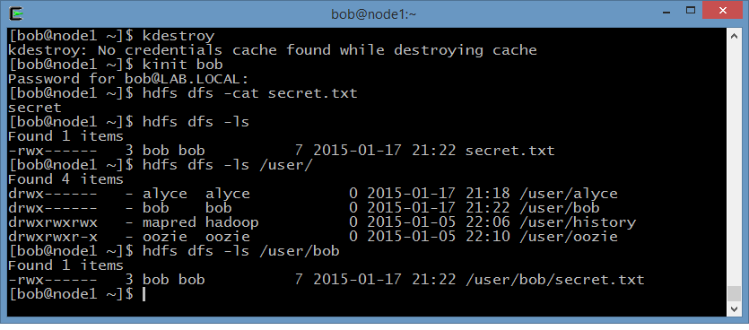
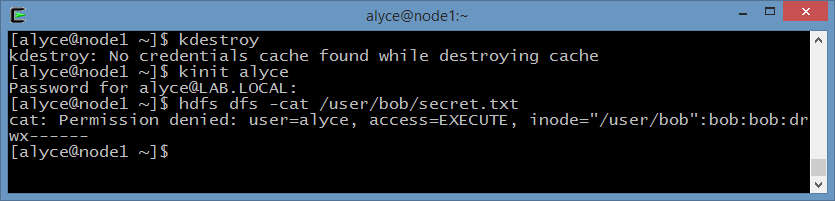
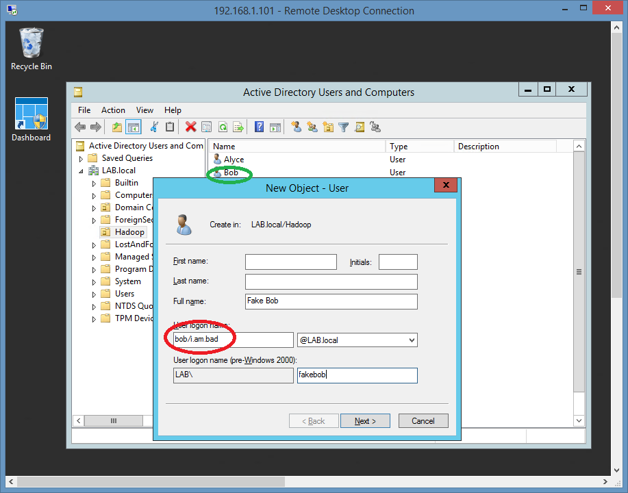
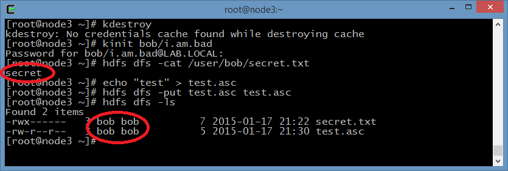
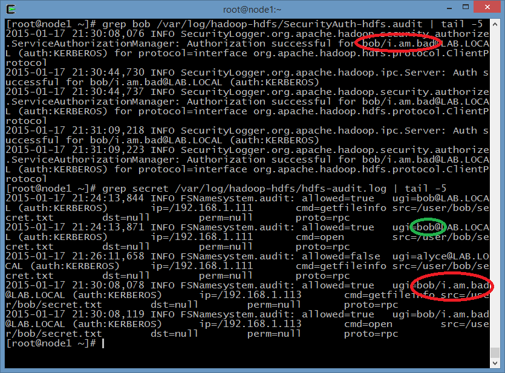

Hadoop has one security parameter, which importance I think is not stressed well
enough in currently published documentation. While there are instructions on how
to configure it, I did not see anyone talking about the consequences of leaving
this parameter with its default value, and as far as I know, almost nobody ever
changes it due to complexity. This parameter is

> **hadoop.security.auth\_to\_local - "**Maps kerberos principals to local user
> names"

(description from
[current core-default.xml](https://hadoop.apache.org/docs/current/hadoop-project-dist/hadoop-common/core-default.xml
"Latest Apache Hadoop core-default.xml")**)**

It's telling Hadoop how to translate Kerberos principals into Hadoop user names.
By default, it simply translates `<user>/<part2>@<DOMAIN>` into `<user>` for
default domain (ignores the 2nd part of Kerberos principal). Here's what current
[Apache Hadoop documentation](http://hadoop.apache.org/docs/current/hadoop-project-dist/hadoop-common/SecureMode.html#Mapping_from_Kerberos_principal_to_OS_user_account
"Current Apache Hadoop Documentation") says about it:

> "By default, it picks the first component of principal name as a user name if
> the realms matches to the default\_realm (usually defined in /etc/krb5.conf).
> For example, host/full.qualified.domain.name@REALM.TLD is mapped to host by
> default rule."

This means that for example if you have users with names hdfs, Alyce and Bob,
and they use the following principals to authenticate with your cluster:

```
HDFS - hdfs@YOUR.DOMAIN,
Alyce - alyce@YOUR.DOMAIN,
Bob - bob@YOUR.DOMAIN
```

If `auth_to_local` is not configured in your cluster, those are actually not the
only principals that can authenticate as your Hadoop users, because the
following principals, if exist, will also become your HDFS, Alyce and Bob per
the default mapping:

```
hdfs/host123.your.domain@YOUR.DOMAIN => hdfs
hdfs/clusterB@YOUR.DOMAIN => hdfs
alyce/team2@YOUR.DOMAIN => Alyce
alyce/something.else@YOUR.DOMAIN => Alyce
bob/library@YOUR.DOMAIN => Bob
bob/research@YOUR.DOMAIN => Bob
```

... (very, very large list of possible combinations of second part of Kerberos
principal and domain name) ...

```
hdfs/<anything>@YOUR.DOMAIN is HDFS
alyce/<anything>@YOUR.DOMAIN is Alyce
bob/<anything>@YOUR.DOMAIN is Bob
```

For many regulatory bodies and auditing companies, this is a baseline security
requirement for every user on the system to have only one unique identity. As we
just learned, in Hadoop, by default, users de-facto can be identified with
almost an infinite number of IDs. And this can be exploited by malicious users
inside company to get access to sensitive data or fully take over control of the
cluster.

Let's look at an example:

First, user Bob with principal `bob@LAB.LOCAL` uploads a file `secret.txt` to
his home directory in HDFS and ensures its protected by access lists:



Alyce can't access Bob's secret file, even if she knows where its located:



A new principal is created in Active Directory, `bob/i.am.bad@DOMAIN.LOCAL`
whether by tricking AD admin, or by the admin himself:



Now the person who owns the new principal can access all Bob's information,
including his secret file. As you can see, Hadoop sees `bob/i.am.bad` as `bob`,
and the newly uploaded file by this user becomes a legit Bob's file:



The same can be done to any user of your cluster, including superusers. In a
typical Active Directory setup, usernames and groups information is open for all
domain users, so it will be easy for a malicious user inside the company to
establish their targets and plan their actions.

But in the end, some good news, too: HDFS Audit logs still track full principal
names, so you can check if this took place in your cluster, and monitor this
kind of activities until the issue is fixed.



I am still working on the best solution for this issue and a filter for
auth\_to\_local that will work for most. I will publish it when it's ready, but
please feel free to contact me if you want to speed this up or work on this
together. Currently I am at the point where I am going to try exclude use of
second part of Kerberos principal completely - in modern world, and in majority
of secure Hadoop clusters I am aware of, Active Directory is the provider of
Kerberos, and second part of principals name is no more used by System
Administrators and Identity/Access Management teams.
