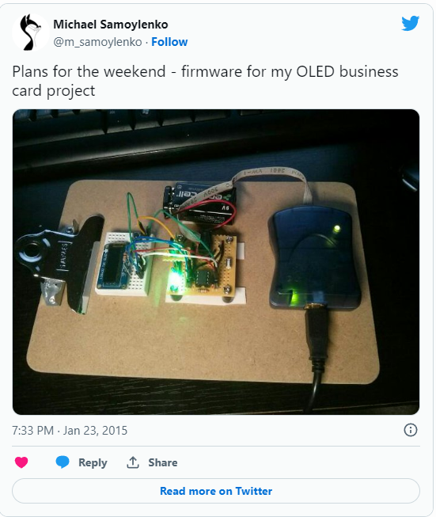

Making another attempt to reactivate my OLED business card project. Due to lack
of time and other priorities, I had to stop it for several months. I think that
I've find an optimal hardware design and power source. Given limitations of
ATtiny85, I started writing firmware in assembly, now I am starting it again in
C.

The board on picture was assembled to allow me work at kitchen table while
watching my kids :)

At the picture (left to right):
[Adafruit Monochrome 128x32 I2C OLED graphic display](http://www.adafruit.com/products/931)
(SSD1306), 9V battery, DYI ATtiny85 dev board,
[AVRISP mkII](http://www.atmel.com/tools/AVRISPMKII.aspx) programmer

