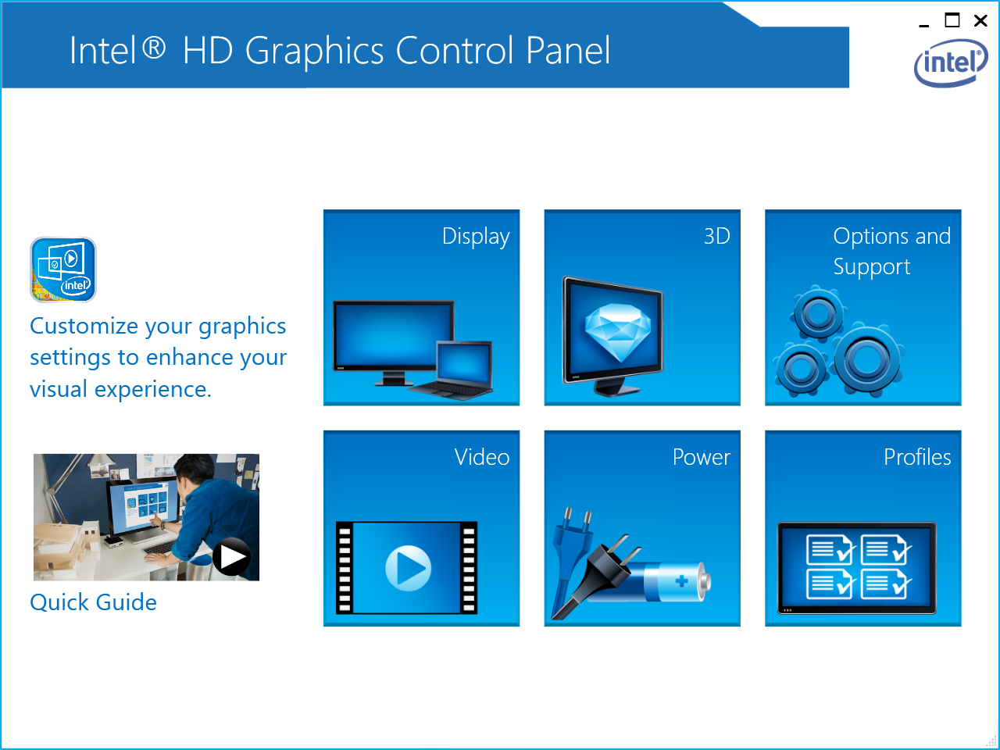

**upd**: Even better solution is to use the latest Windows 8.1 ISO which can
downloaded using the following Microsoft's tool. It instantly detects the video
adapter and installs the required driver.
[http://windows.microsoft.com/en-us/windows-8/create-reset-refresh-media](http://windows.microsoft.com/en-us/windows-8/create-reset-refresh-media)

This seems to be a standard problem for many Lenovo laptops: after Windows 8
enters sleeping mode, computer does not wake up - all the lights and fans are
on, but display remains always black, until reset.

Support forums did not help much - people talk about this problem for a couple
of years already, some advice updating BIOS, but this did not work in my case.
Only the stock image from Lenovo Recovery CDs seemed not to have this problem
(but did have Superfish and stuff ;-) )

Solution appeared to be quite easy - I just needed to install the latest Intel
HD Graphics Driver :) That's it. Here's the location of this driver:
https://downloadcenter.intel.com/download/24785/Intel-Iris-and-HD-Graphics-Driver-for-Windows-7-8-8-1-64-bit

It just seems that Lenovo System Update software does not update this driver
automatically.

