In this post, I am going to illustrate that it's practically impossible to
protect any data in Hadoop clusters without Kerberos ('Secure mode') enabled. I
hope this will help admins and security folks see that Kerberos is the only way
to make Hadoop more or less secure - without it, there is no authentication in
Hadoop at all. But as you can see from my
[previous posts about Hadoop](./2015-04-15-hadoop-security-auth_to_local-examples.md),
even with Kerberos enabled, there are still very serious challenges, so Kerberos
is just a start, not the final solution.

At this time, I will focus on the most important component of Hadoop ecosystem -
HDFS, Hadoop's distributed file system which is used to store all data in Hadoop
in most cases.

# 1. Target setup.

For this, I will create 2 Hadoop clusters in my lab:

- Cluster 1: used by Alice and Bob
- Cluster 2: used by Cindy and Dan

Each user will have their own home folder in HDFS protected by access lists, and
a secret file which must not be accessible to anyone but the owner:

| File Owner | File Name        | Content             | Location               | Permissions   |
|:-----------|:-----------------|:--------------------|:-----------------------|:--------------|
| Alice      | alice_secret.txt | Alice's secret file | Cluster1: /user/alice/ | rw---- (0600) |
| Bob        | bob_secret.txt   | Bob’s secret file   | Cluster1: /user/bob/   | rw---- (0600) |
| Cindy      | cindy_secret.txt | Cindy’s secret file | Cluster2: /user/cindy/ | rw---- (0600) |
| Dan        | dan_secret.txt   | Dan’s secret file   | Cluster2: /user/dan/   | rw---- (0600) |

Creation of secret files:

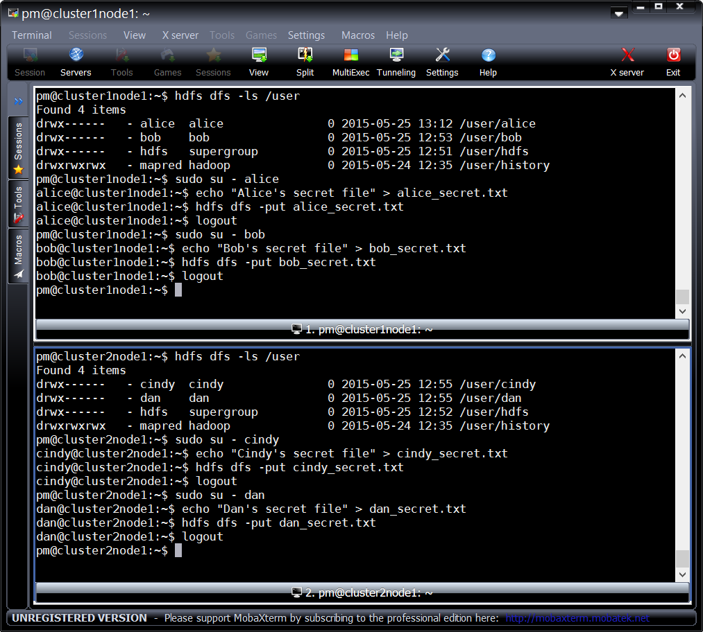

Checking security of secret files:

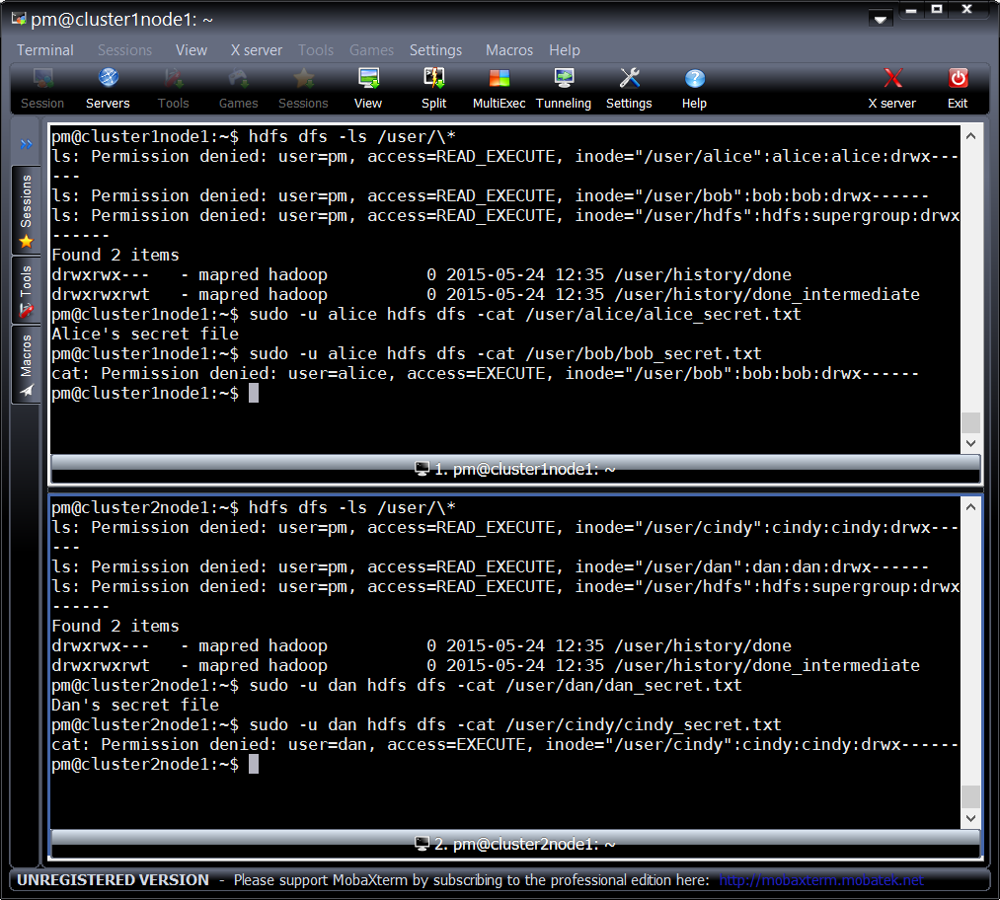

At this time, Kerberos is not enabled at both the clusters, so let's see how we
can attack Hadoop clusters which don't have Kerberos enabled.

The biggest challenge around attacking Hadoop clusters without Kerberos is
descovery of IP addresses and ports of Hadoop daemons - the rest is quite easy.
All my scenarios are 'internal attacker' only - I hope no one these days exposes
their Hadoop clusters to the Internet, it'd be a huge mistake. I will leave the
discovery of Hadoop services outside of the scope of this post, but you can use
e.g.
[Cloudera's Hadoop port reference](http://www.cloudera.com/content/cloudera/en/documentation/core/latest/topics/cm_ig_ports.html)
to begin with.

# 2. Attacking No-Kerberos Hadoop Clusters

For the most Hadoop installations that I've seen, only a web browser and a REST
client like CURL are needed to break into a Hadoop cluster :) But below, I will
also use Hadoop client - just for the full picture.

## 2.1. Web browser based attack

By default, HDFS comes with Web UI enabled. And it's usually available at port
50070 (we are connecting to Name Node Web UI):

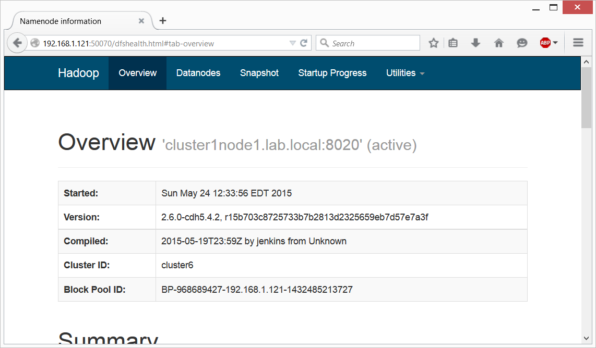

The problem is, this port is quite complex to protect, and the common way is to
enable Kerberos at it. Otherwise it's accessible by anyone, or there will be a
custom authentication solution (I never encountered one in my 2 years Hadoop
Security journey, so probability is very low).

It'll not take long until you will discover your way to browse HDFS (located in
"Utilities"->"Browse the file system"):

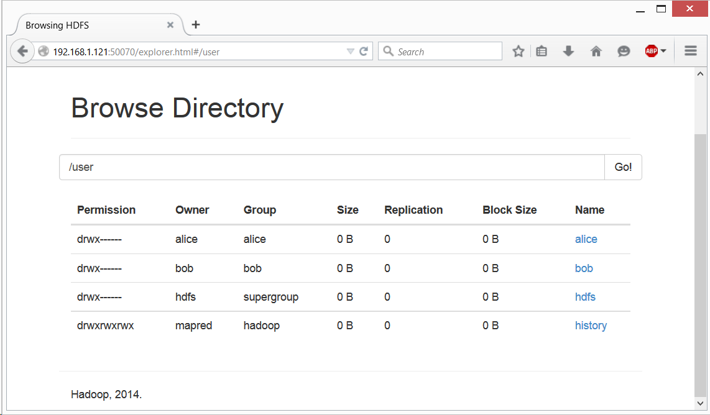

But when you will try to access Alice's or Bob's data, you'll get an expected
"Permission Denied" error:

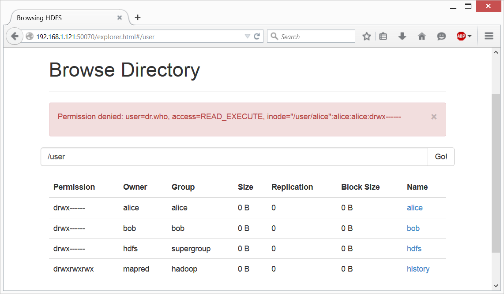

This web-server runs as 'Dr. Who' user by default, and this user definitely has
no access to Alice's or Bob's file. This is an expected behavior, but in Hadoop,
with Kerberos disabled, unfortunately it's too easy to circumvent this. Simply
said, Hadoop will trust any username you will provide to it. Just type the
following into the address line under "Browse Directory" (the one that has "Go!"
button in the end), and you'll get access to Alice's directory:

> /user/alice?**user.name=alice**&op=LISTSTATUS#

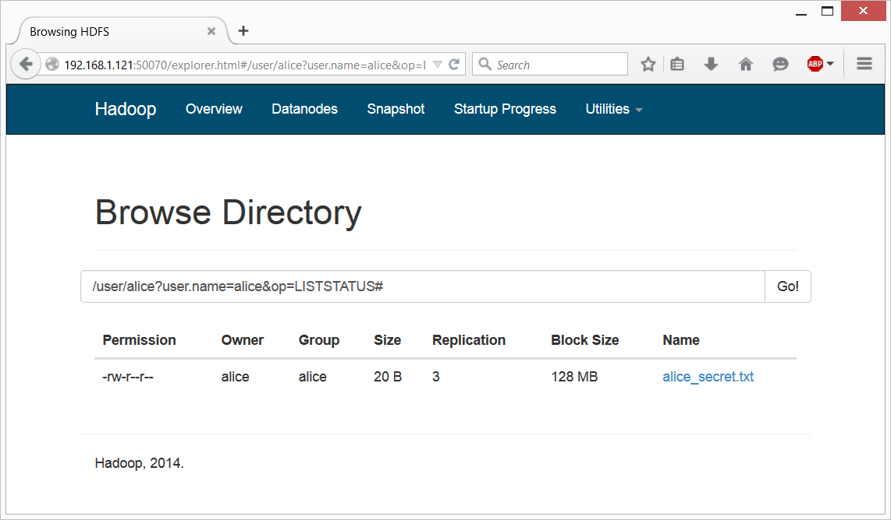

**As you can see, by default Hadoop just accepts parameter "user.name" as the
current user's name, with no authentication.**

What's interesting - this one I've just encountered, this is something new that
I had to put this data into the web form's field, and suppress whatever it adds
at the end of URL via the `#` character. In previous versions of Hadoop you
could just add `?user.name=<user>` parameter to the end of your browser's
current URL and get access to anything.

As you can see, it's very easy to get through any Hadoop ACLs (access lists) -
it will always tell you the object owner's username, and you can always add it
as a `user.name` parameter and become this user. We'll use this with CURL as
well.

## 2.2. REST API based attack

Full information how to access HDFS via REST is available at this page:
[http://hadoop.apache.org/docs/current/hadoop-project-dist/hadoop-hdfs/WebHDFS.html](http://hadoop.apache.org/docs/current/hadoop-project-dist/hadoop-hdfs/WebHDFS.html)
Very simple - just like above, we only need to add "user.name" parameter in the
end. And, as always, the biggest challenge is to locate the WebHDFS IP address
and port - the same as we used above. 50070 by default.

The trick is to properly construct URL for your tool (cURL in my case) - it's
fully documented in the Apache document referred above:

```
curl -i "http://192.168.1.121:50070/webhdfs/v1/?op=LISTSTATUS&user.name=alice"
         ^1                        ^2         ^3 ^4          ^5 

Where: 
 1 - http://<namenode address>:<port>
 2 - Constant: "/webhdfs/v1"
 3 - Path. At this example, it's "/" - filesystem root
 4 - operation "?op=<operation>"
 5 - any user name
```

So, we can just browse using REST API and give it an owner name when encounter
an ACL:

1\. Let's see what's in `/user`:
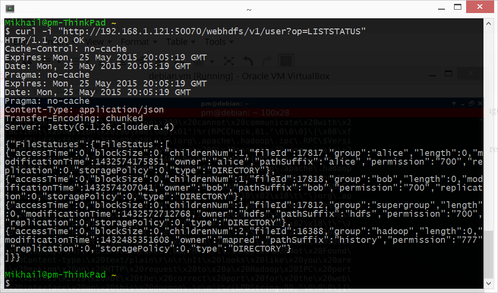

Alright, we see "alice", "bob", "hdfs" and "history", with all the information
including owners.

2\. Let's try to open Bob's user directory:

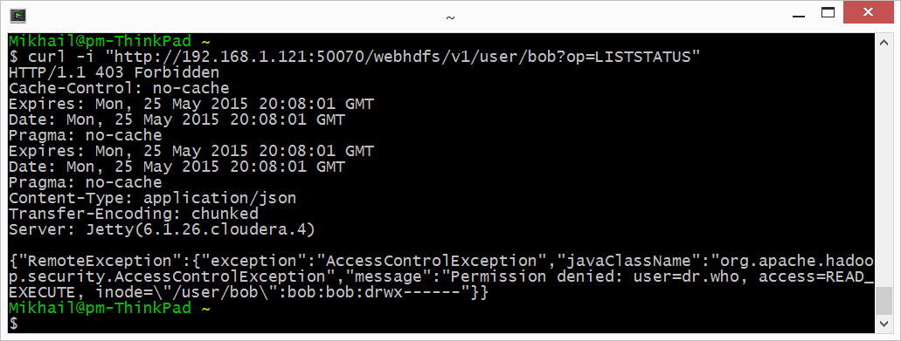

3\. No access as expected. Ok, let's try again with 'user.name=bob' this time:

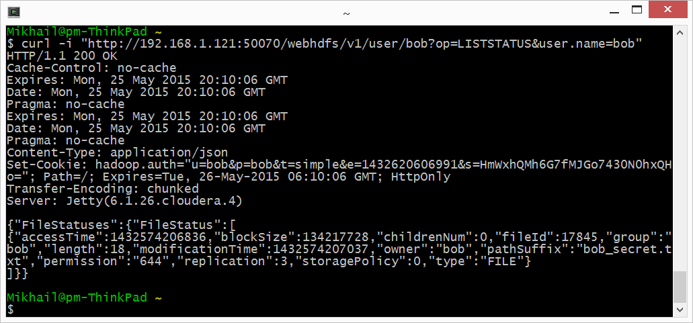

4\. Now we see Bob's secret file. Let's open it:

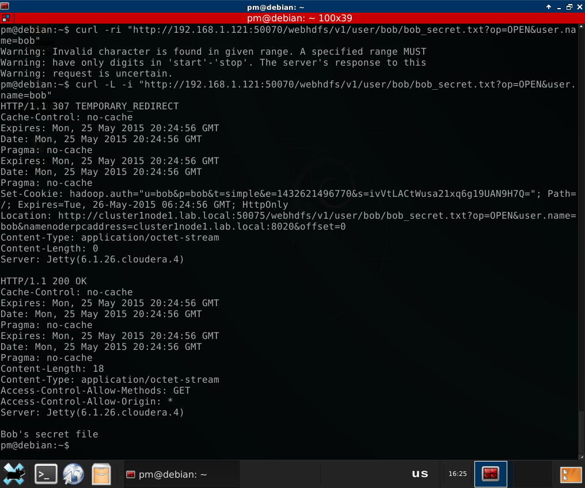

(note that I had to add the `-L` switch to cURL to enable it follow redirect -
all data in HDFS is stored at Data Nodes, and Name Node redirects the client
directly to the Data Node which has the data)

As you can see, we have successfully opened Bob's secret file.

Same with Alice at the same cluster, and with Cindy and Dan at cluster 2:


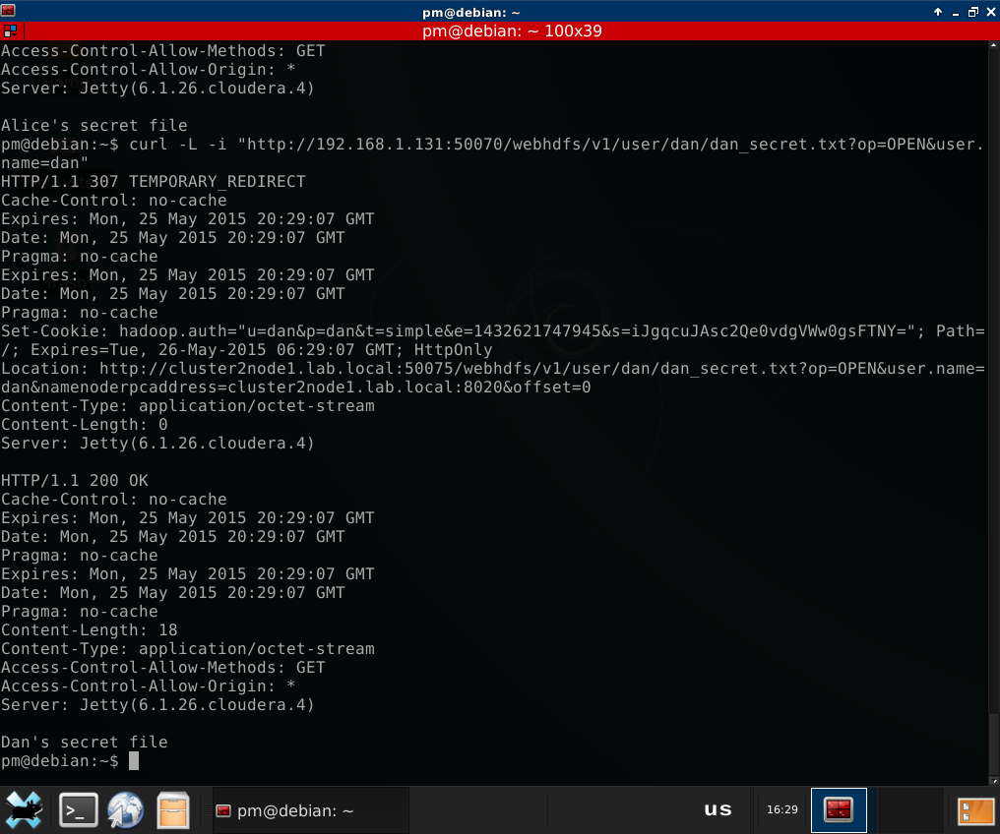

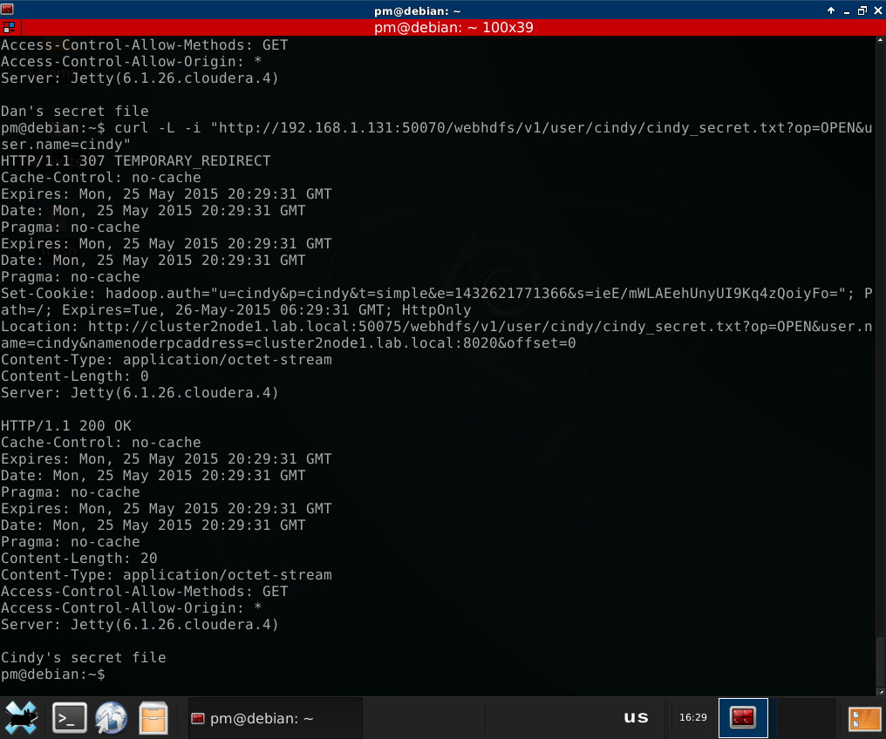

As you can see, it's still the good old `user.name` parameter. Let's do
something different now

## 2.2. Hadoop Client based attack

If you prefer to use Hadoop client, it's even simplier. Let's install it first.
It's very easy - just download, unpack and set the `JAVA_HOME` variable:

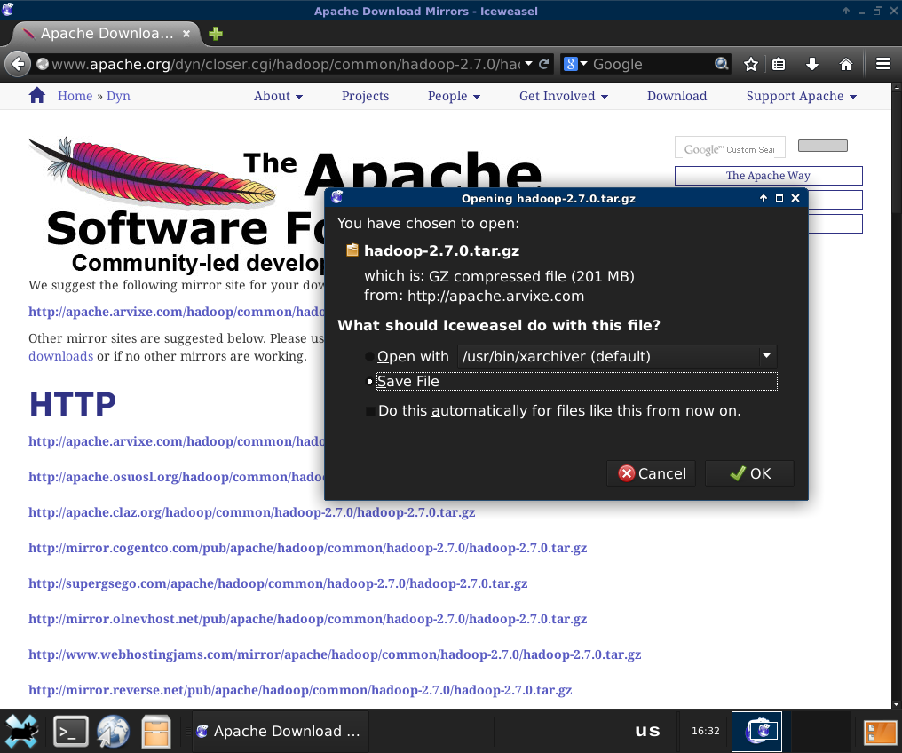

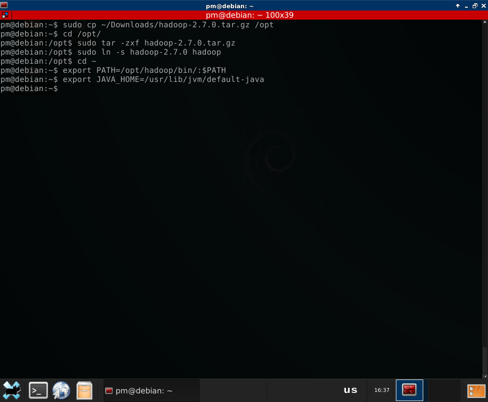

Typical command to access HDFS in Hadoop is "hdfs dfs -<command> <path>". E.g.
to list '/user' directory:

```shell
hdfs dfs -ls /user
```

In our case, we are an attacker, and we are not part of the cluster, so we are
adding another parameter to this command - `-fs` to point it to the NameNode we
will be working with. it's usually the same IP we used before, but a different
port. Default is 8020 (Name Node port, I am using
[Cloudera](http://www.cloudera.com) distribution). Let's try it:

```shell
# Cluster 1
hdfs dfs -fs hdfs://192.168.1.121:8020 -ls /user

# Cluster 2
hdfs dfs -fs hdfs://192.168.1.131:8020 -ls /user
```

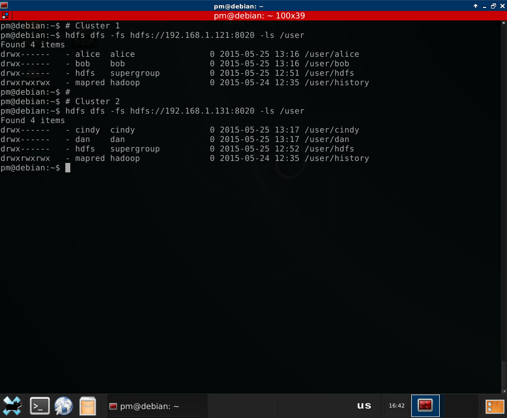

Now let's try and access Dan's protected directory:

```shell
hdfs dfs -fs hdfs://192.168.1.131:8020 -ls /user/dan
```

'Permission denied', as expected. Well, 'user.name' won't work here, because
that was a parameter for Web access. But there are two ways to become 'Dan' for
Hadoop at client side. Both are very easy. And as you can see, I am working from
a PC that does not belong to any of the targeted clusters. It's a virtual
machine that can be anywhere on the network.

### 2.2.1. Environment variable

First way is to set an environment variable called `HADOOP_USER_NAME` :) Yes,
just like this:

```shell
export HADOOP_USER_NAME=<user>
```

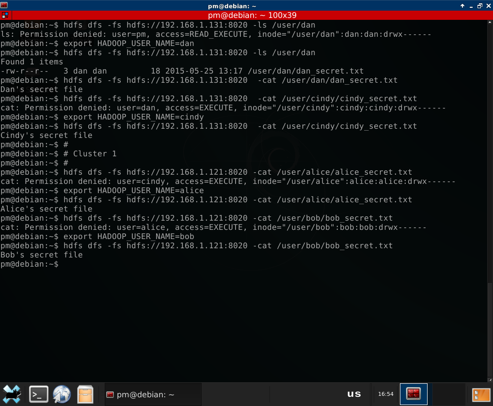

### 2.2.2. Local OS user

Just wanted to add another way to change user name for a Hadoop cluster without
Kerberos enabled. Just for the sake of completeness. It requires root privileges
at the local system (scenario with e.g. developer from inside organization runs
a VM just like I do).

By default, Hadoop client takes current user name from operating system and
passes it to the server. So as an admin at my VM, I can create 'dan', 'alice',
'bob' or 'cindy' local user and run Hadoop client as this user:

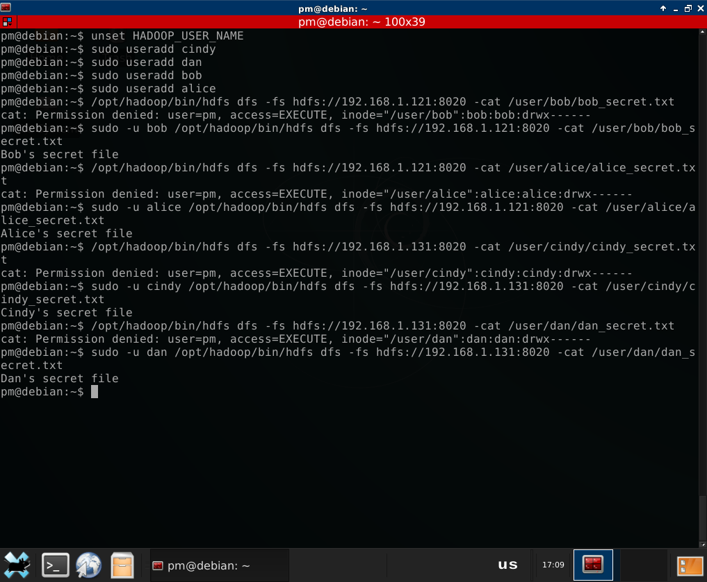

# 3. Hadoop Security without Kerberos - conclusion

As you can see, there is no authentication in Hadoop without Kerberos. Any
Hadoop cluster without Kerberos authentication enabled is de-facto a single-user
system, where the user is identified by its ability to access Hadoop services,
and this user has full admin access to the cluster (I skipped superusers
impersonation for a purpose)
