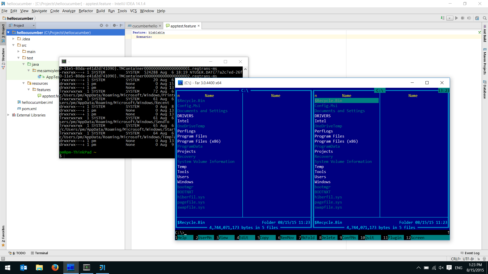

I've got Windows 10 at my laptop around 3 weeks ago and was testing it since. I
do like the new design, and the OS itself is definitely better than any previous
Windows version, including 7. And all of my life I've always been a Windows guy,
preferring Linux only in server or virtual environments. But I just can't leave
all the
[privacy concerns](https://www.google.com/search?q=windows+10+privacy) be. I
hate the idea someone is constantly watching what I am doing and where I am
going. And I can't bear the fact that Microsoft can scan my hard drive or sneak
on me through my webcam anytime they want. It's gone way too far.

When they announced the free upgrade, I knew it will be something serious and
users will have still have to pay, but in some different way. Well, now we know
what it is... Sorry, Microsoft, I am not buying this anymore.

Three years ago, when I wanted to refresh my software development skills and
learn something new on a professional level, I was choosing between C# and Java,
and I really wanted it to be the former given all of my previous experience, but
the price of Visual Studio and MSDN subscription was astronomical, and
everything was restricted to only one OS and one vendor while for Java
everything was free and cross-platform. The choice was obvious and now I am a
Java programmer in addition to my other skills.

Now it's my home desktop operating system's turn, and the choice is obvious as
well...

Goodbye, Windows, taking your last picture for memories:

