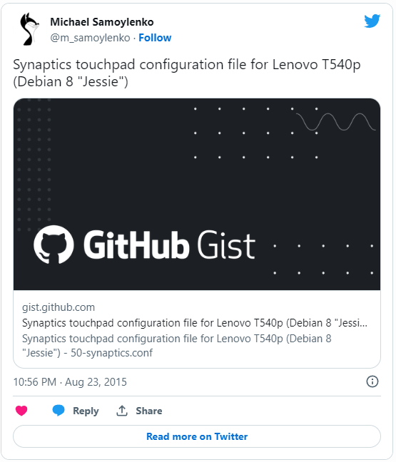
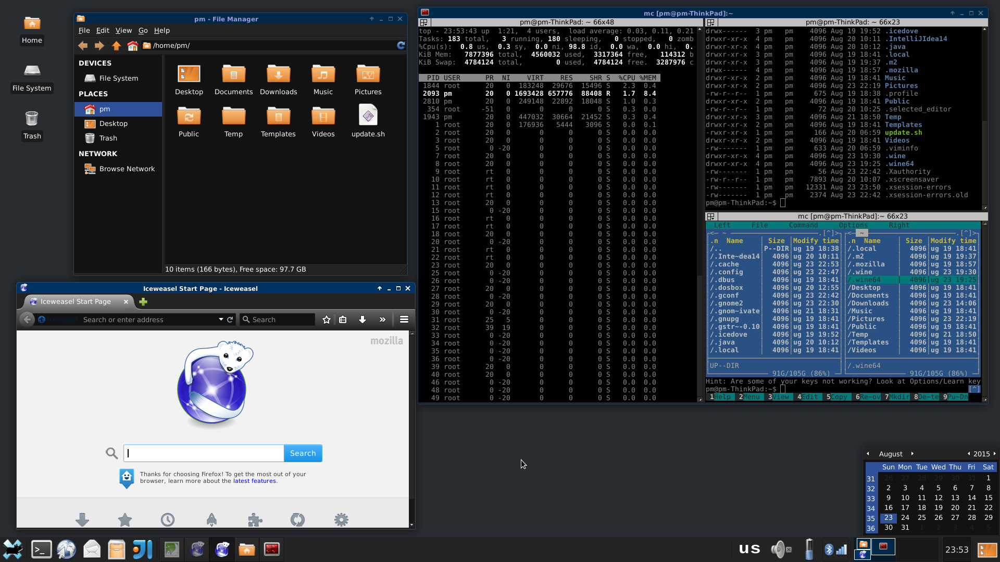

When I
[said my last goodbye to Windows](./2015-08-15-farewell-windows.md), I thought
it will be
[Ubuntu](http://www.ubuntu.com/) to become my new primary home operating system
\- I had it for a couple of years in past, with very very good experience for
both me and my wife, don't even remember why I switched back to Windows.
Probably because I disliked what they did to Gnome, or the switch to Unity, or
[Il-2 Sturmovik](http://store.steampowered.com/app/15320/) did not work well
with Wine, or all three together and lack of time to deal with it - so I thought
I'll pay Microsoft to make all decisions for me... I really don't remember now.
But for me, it was always clear that Ubuntu is the best Linux distribution for
desktop hardware because of its superior support for drivers and firmware. I
prefer
[Debian](http://www.debian.org/) at my virtual desktops and Ubuntu again at
servers, both hardware and virtual.

So I removed Windows 10 and installed Ubuntu, and spent a couple of days playing
with it - everything worked well, but I was really missing my Debian
[XFCE](http://xfce.org/) customized desktop experience to which I am used to.
And I decided to try Debian at my laptop. I was sure I won't be able to get it
work with my wifi card, or cardreader, or something else... I was so surprised
that everything worked out of the box! And the install went smooth, over wifi,
and everything was just great! The biggest surprise, however, was that Debian
appeared to work much better with my Microsoft (hehe) Bluetooth mouse than
Ubuntu. Hibernation, suspend, sensors etc work without any problems as well.

It's been almost a week, and I am very happy with Debian as my primary OS now. I
am very confident it will stay, and I am not switching back to Windows or even
Ubuntu any time soon - I have an old EEE-PC with Debian installed for around 2
years already (for kids to play) which I was periodically checking and updating,
and was amazed of how good and stable it is.

I only had to do two things to make it happen:

1. I used
   [unofficial Debian installer with non-free firmware support](http://cdimage.debian.org/cdimage/unofficial/non-free/cd-including-firmware/)
   to install it at my laptop.
2. I had to manually add my touchpad configuration to enable all the fancy
   multi-touch etc:

Here's a screenshot of my Debian desktop:

