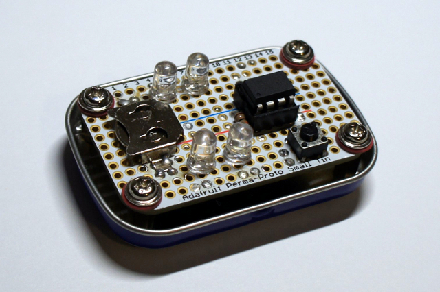
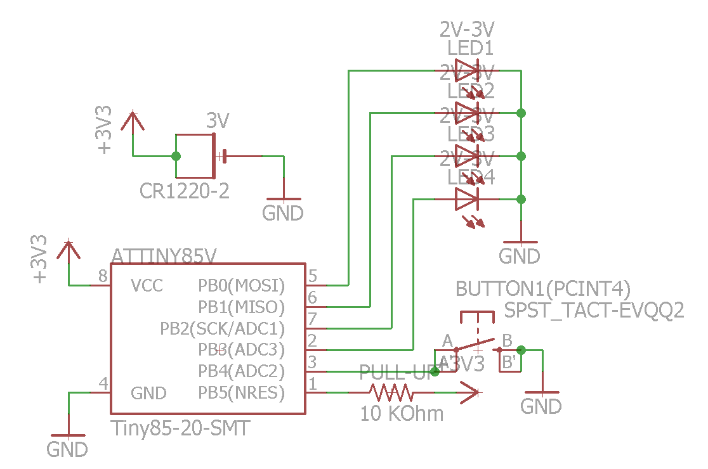

I really enjoyed this. I know it does not look like much, but I am very happy
about this little project: I finally learned how to solder properly and
lead-free, and I now understand AVR microcontrollers architecture and specifics.
What's left is to finish power optimization and start periodically add different
sequences for LEDs and different reactions to button clicks.

And I also learned about powering small devices and about
[Joule Thief](https://en.wikipedia.org/wiki/Joule_thief) / step-up regulators,
induction, surface-mount and PCB design/ordering (however, these are not used in
this project)

**Github:**
[https://github.com/samoylenko/avr\_s1](https://github.com/samoylenko/avr_s1)

