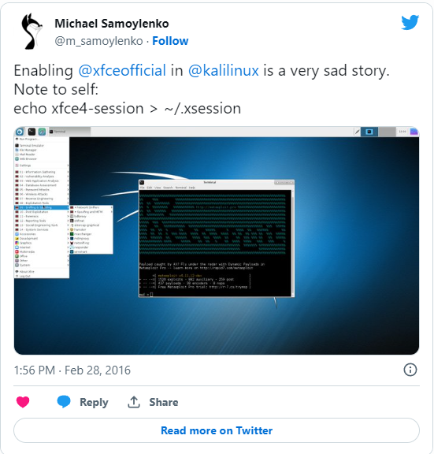

Installed
[Kali Linux](https://www.kali.org/) in my virtual lab this weekend - just to
make a snapshot of currently available packages and, as usual, steal a couple of
ideas for my own pentest Linux VM. Two ideas I will never steal from Kali are
Safari Icon for Firefox and use of Gnome 3.

