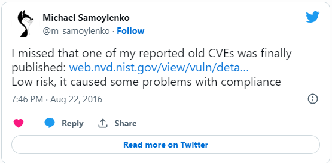

CVE-2014-8733:
[https://cve.mitre.org/cgi-bin/cvename.cgi?name=CVE-2014-8733](https://cve.mitre.org/cgi-bin/cvename.cgi?name=CVE-2014-8733)

It was fun to work with Hadoop security in 2014... This vuln was a tricky one
because I was responsible for Hadoop managed service platform security, and our
clients had SSH access to Hadoop cluster nodes in some cases.

If I remember correctly, fix wasn't easy - required release of new CDH version
which moved configuration parameters between files (world readable access was
required for Hadoop client to function). And then, several months later, it
reappeared again after another patch.

