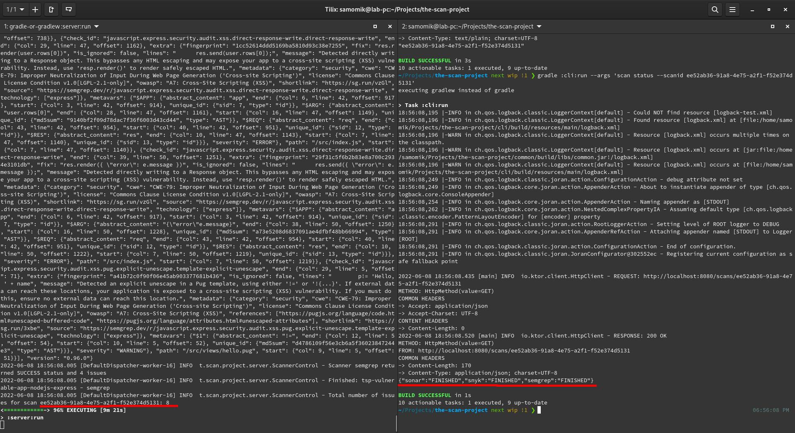

As of today, TSP has three plugins:

* [SonarQube](https://www.sonarqube.org/)
* [Snyk](https://snyk.io/)
* [Semgrep](https://semgrep.dev)

So what I've been doing for the last three years? :) The trick is it's
straightforward to add a new plugin, thanks to all the underlying code I've
already written. For example, the Semgrep plugin is currently just 92 lines,
Snyk plugin - 126, and SonarQube - 135.

In the screenshot, you can see a debug console with Semgrep results. I highly
recommend this tool. Based on my tests, its detection rate is quite high. And
with my current testing project, it's even higher than Veracode's. For example,
I don't see many SAST tools that would
detect [that Pug template finding](https://github.com/the-scan-project/tsp-vulnerable-app-nodejs-express/blob/main/views/hello.pug).

The plugin list above is the standard set of tools I used in the past. The only
missing one is Veracode - they were the only ones who never responded to my
email asking for help writing a plugin for TSP. But I've spent months working
with Veracode scan automation at my previous employers, so if there will be a
TSP customer interested, it won't take much time to create that plugin, just
need a license for a few days. But I would recommend the
new [Snyk Code](https://snyk.io/product/snyk-code/)
and [Semgrep](https://semgrep.dev/) over it in the modern CI/CD pipelines.
