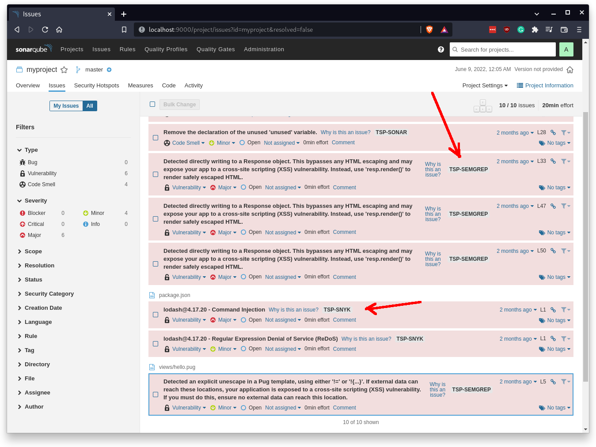
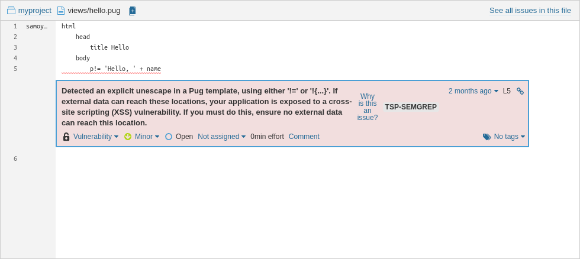
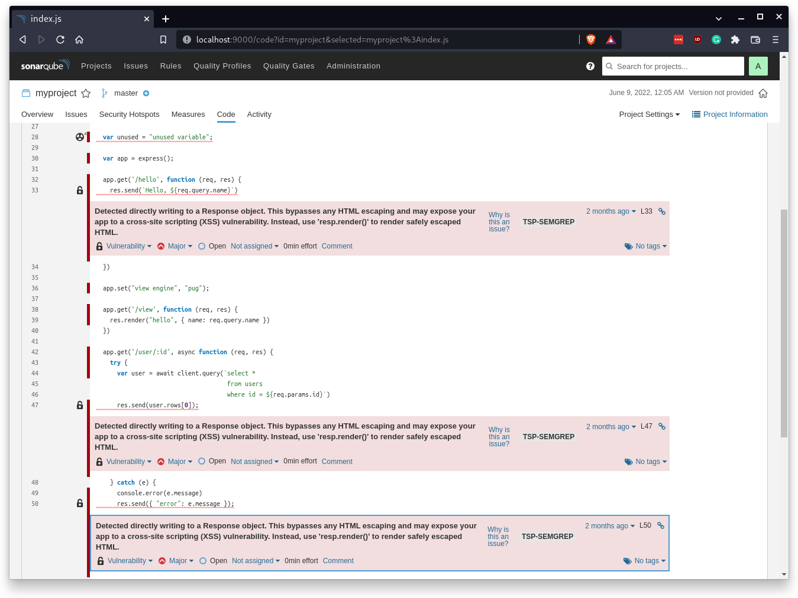

The first item I wanted to try was to bring all the scans together on the same
page, and as always, the fastest way to do that is by
using [SonarQube's support for 3rd party issues](https://docs.sonarqube.org/latest/analysis/generic-issue/),
so here's what it looks like at the moment when TSP's sonarqube export format
is used. At this time, I am mostly testing using the 
[vulnerable node app](https://github.com/the-scan-project/tsp-vulnerable-app-nodejs-express).

