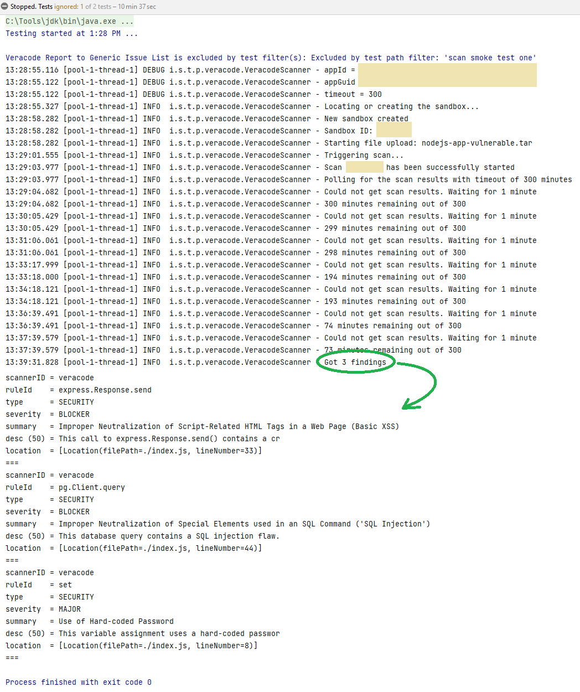

It's a coincidence that I am publishing this post seven months after the last one. 2022 has been a very tough year, so
the work on TSP progressed more slowly than I'd like to.

But today, a working Veracode plugin is a critical milestone to share.
Adding support for so-called "long-running" scans that have to be tracked asynchronously from the software delivery
pipeline required a complete refactor of the MVP, but here we are. A working test.

In this screenshot, it's nothing new to everyone who has already implemented any Veracode automation - just another
example of polling for results with a timeout.

But the solution behind it enables TSP to support all types of scanners that cannot be run as a blocking part of the
pipeline - and that includes DAST (pentest tools,
like [Zaproxy](https://www.zaproxy.org/), [Burp](https://portswigger.net/burp), [SQLMap](https://sqlmap.org/)), you name
it - even [WPScan](https://wpscan.com/) if you'd like.

Today, a typical size of a fully functional scanner plugin for TSP is 200 lines of code at maximum.

