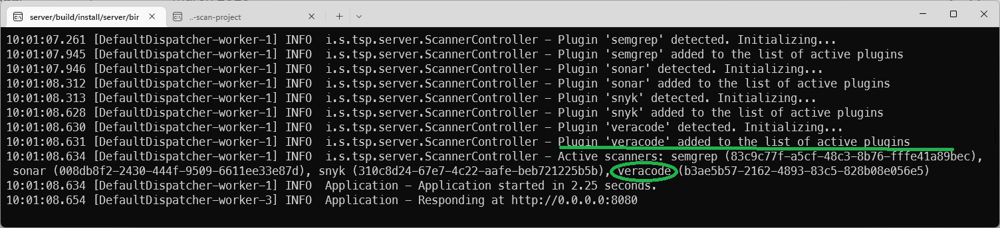
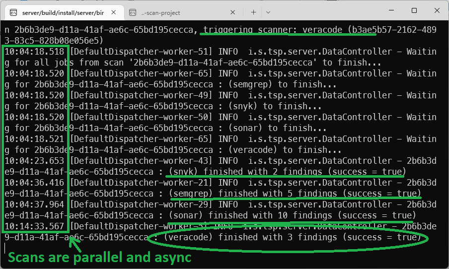
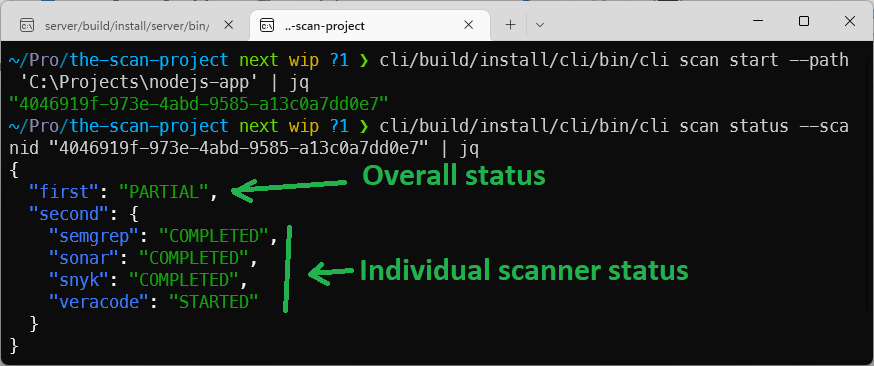
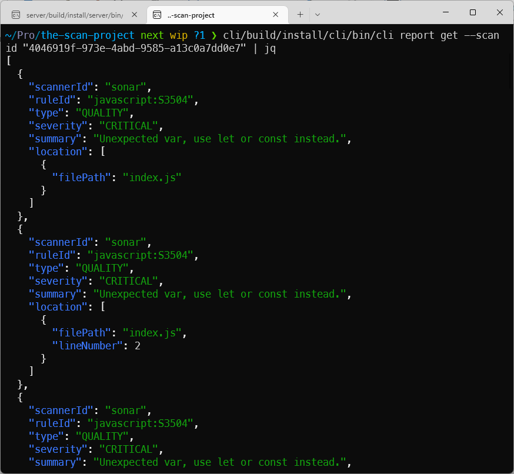
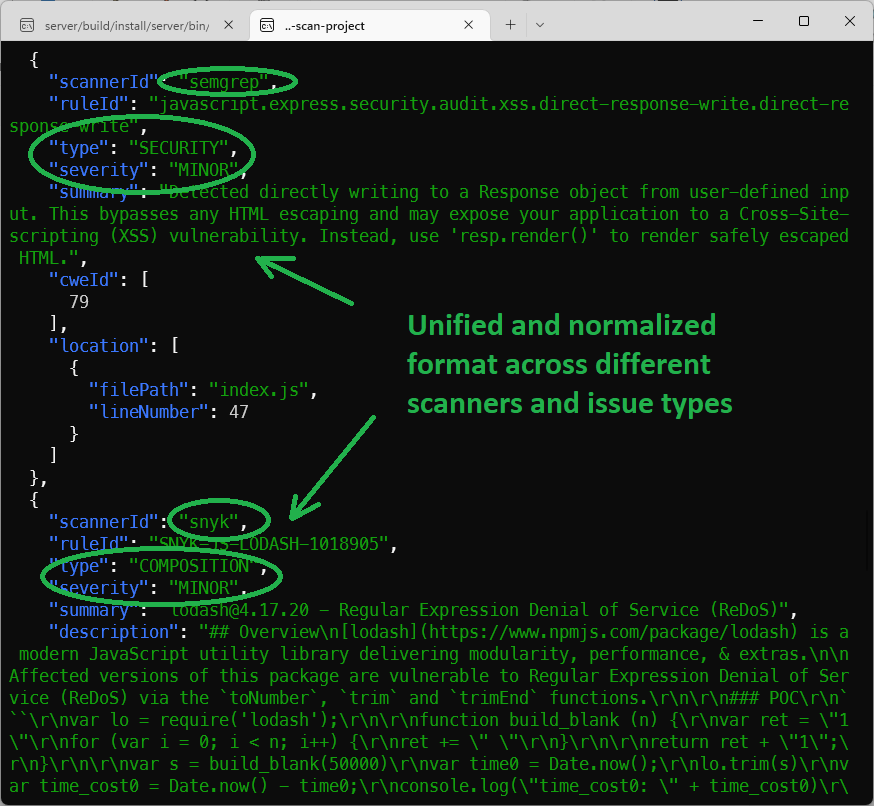
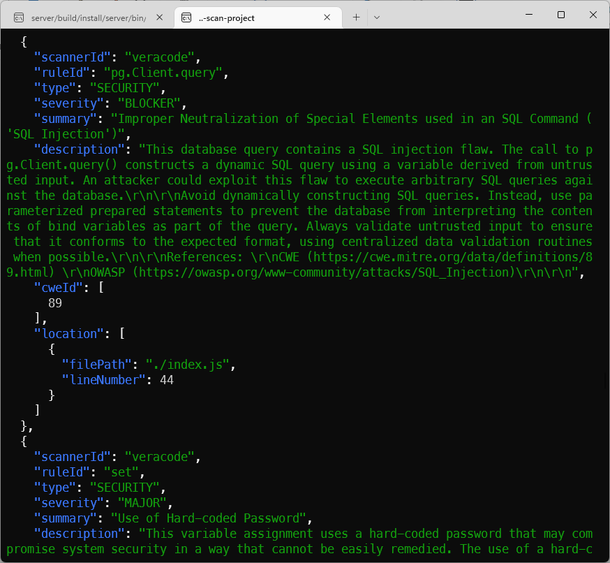
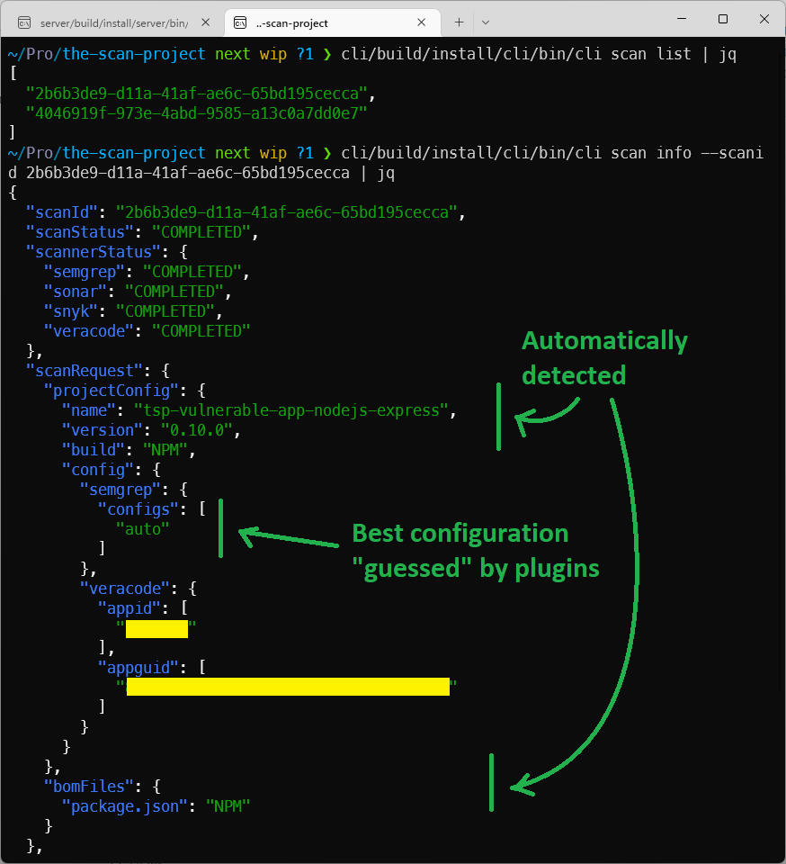

Today is the day :) The first demo of "The (unnamed) Scan Project," aka TSP, to the public.

Currently, TSP consists of two parts:

* Server
* Command Line Interface (CLI)

The server orchestrates different security and quality scanners (SAST, DAST, SCA, human test, QA, Lint, etc.). In
addition, it tracks scan results and diffs between scans, containing logic that helps make decisions if the software is
releasable at any point in time or any step of the pipeline.

A sample scenario:

1. At the beginning of the pipeline, we can ask the server to start Sonar, Snyk, Semgrep, and Veracode scans. The server
   begins all these scans asynchronously and tracks the results. It collects and normalizes, processes, and prioritizes
   all
   findings from different scanners.
2. When the artifact is ready to be deployed in DEV, Sonar, Snyk, and Semgrep results are available, but the Veracode
   scan
   is still going on. That is enough information to decide to deploy in DEV. The server can compare the difference in
   code
   and findings with the previous scans and determine if we can deploy to DEV while we wait for the Veracode results.
3. Now that the app is deployed in DEV, we can ask the server to initiate the DAST scan. Now we have two scans running
   in
   the background: Veracode and, say, OWASP ZAP. But we already have the results from SonarQube, Snyk, and Semgrep and
   can
   act on those.
4. By the time the code/artifact is promoted, or a pull request is created, more time has passed. The server can now add
   the results from Veracode and OWASP ZAP to the picture and help make a (configurable) decision to break the pipeline
   or
   to continue deployment into TEST.
5. When we are ready to promote this version of the artifact (or code) to PROD, we will have Veracode and OWASP ZAP
   scans
   finished, along with anything else that takes a long time to scan. The server can now help the decision if it's ok to
   promote based on comparing the current version of the code with all the other information it has in the database,
   including past scans and any differences between the previous and current code versions.

The CLI is just one of the implementations of clients to interact with the server - this is the part used in CI/CD
pipelines and helps make requests to the server, asking it to initiate scans or help decide on any step of the pipeline.
We will, of course, have integrations with all popular CI/CD platforms and tools and provide container images, GitHub
Actions, etc.

## Demo #1

The server console: Semgrep, Sonar, Snyk, and Veracode plugins are detected and loaded:

The server console: Request to scan a sample application received, scanners triggered in asynchronous mode. Snyk,
Semgrep, and Sonar have finished quickly. We are still waiting on Veracode to finish:

The client console (CLI):

* First command started the scan. It got a `scan id` to track the progress.
* The client checks the status and sees that the results from Semgrep, Sonar, and Snyk are already available, but we are
  still waiting on Veracode:

We can get our results immediately:

All results from different scanners come in a simple, easy-to-process familiar format (multiple export formats are
available via plugins):

While we were looking at the previous results, Veracode results are now available as well, as part of the same report:

In the end, we can just check the detailed scan status and corresponding scanner configurations:

Most of the parameters you see are guessed by TSP. Therefore, there was no need to configure anything except providing
the necessary parameters, such as Veracode AppID. This is the current MVP limitation and will also be automated -
unfortunately, the TSP team has very limited access to testing with Veracode at this time.

(end of the demo)
