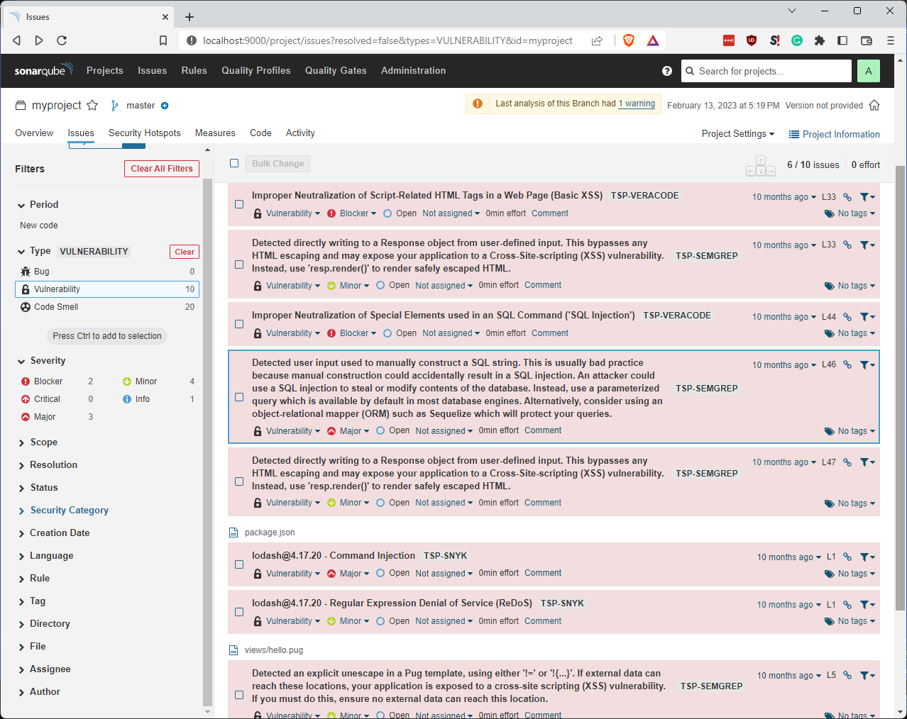
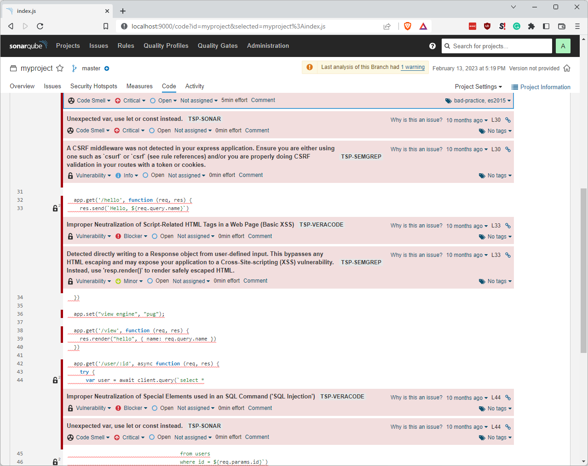
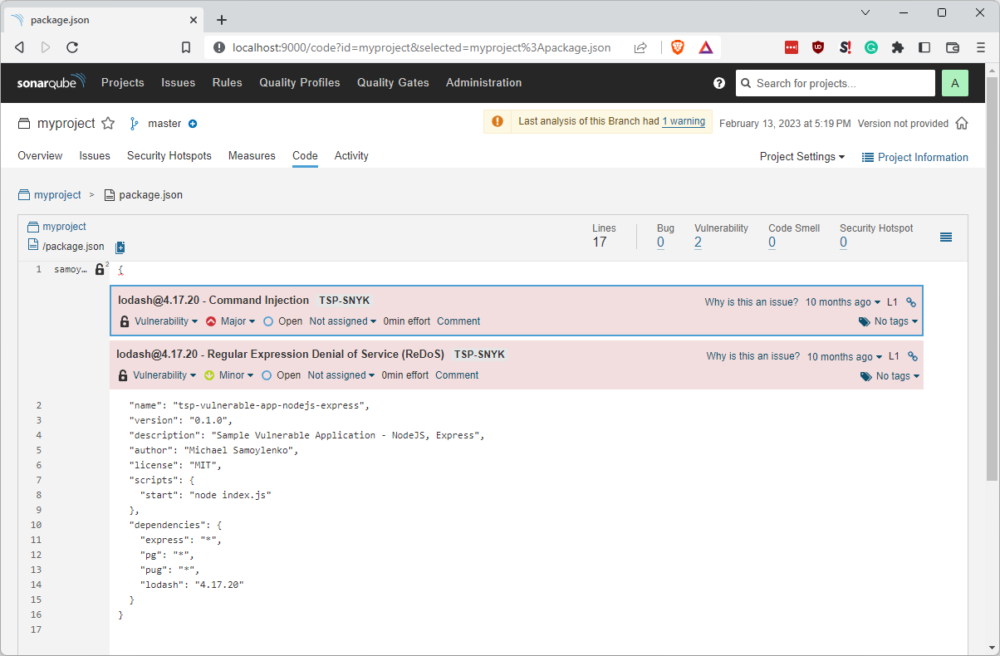
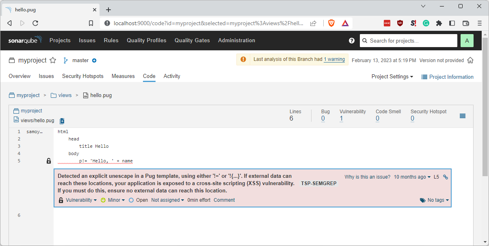

After significant code refactoring and lots of testing, I wanted to share the updated SonarQube screenshots that bring
together vulnerabilities from different scanners, thanks to TSP. It's the usual suspects: Snyk, SonarQube, Semgrep, and
Veracode.

All scanners are brought together at the same dashboard:

Code review with vulnerabilities shown:

Snyk in SonarQube:

Semgrep is the only scanner so far to detect a `pug` vulnerability:

