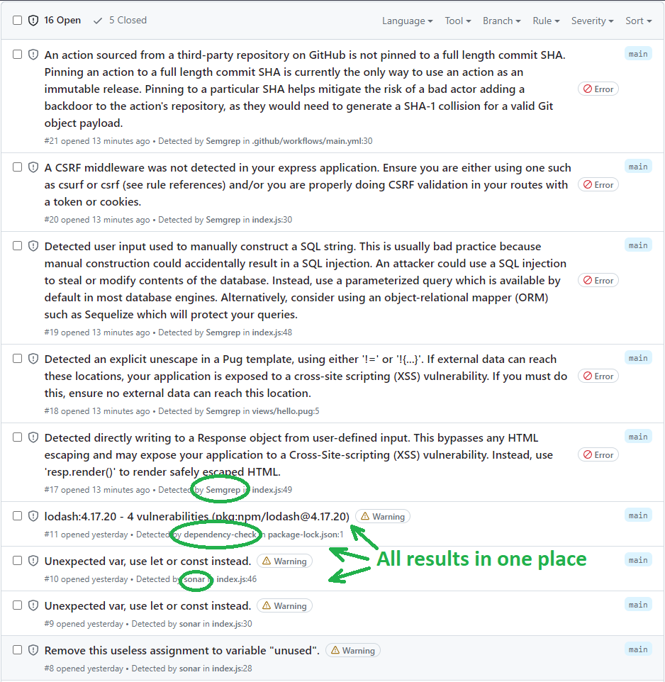
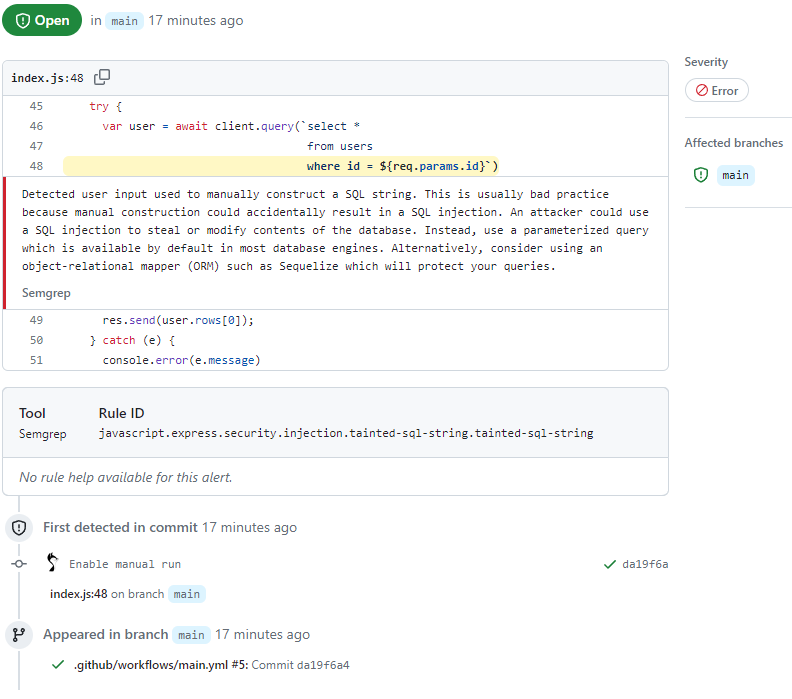
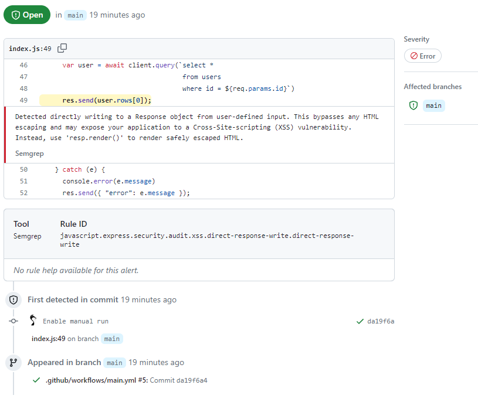
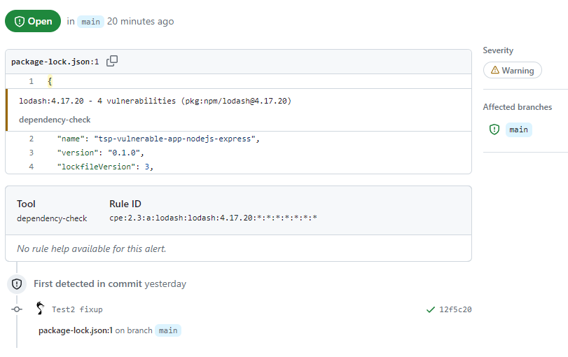
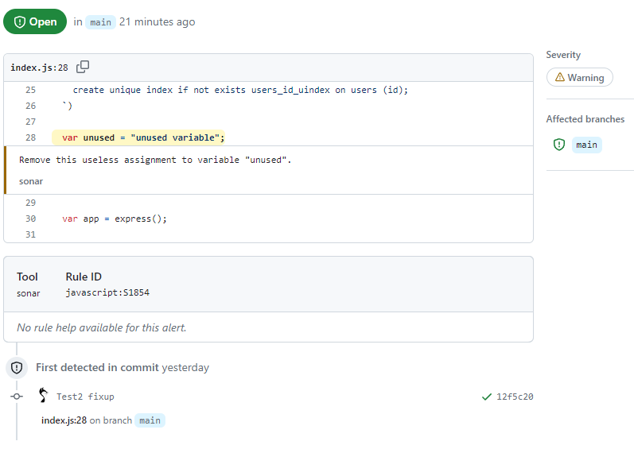

This weekend, I am experimenting with ScanProject Free GitHub Action, which will be available to Scan Project users
soon. It works pretty well, and I love what I see!

Too bad there is no way to open this information for everyone on GitHub, so I have to post screenshots instead.

Of course, some issues remain to fix before making this feature available to the public. As well as description and
details can be extended depending on the users' feedback.

## Screenshots

Scanproject Standalone has detected 16 issues:

SQL Injection finding ([Semgrep Open Source](https://semgrep.dev/pricing/)):

Cross-Site Scripting finding ([Semgrep Open Source](https://semgrep.dev/pricing/)):

Outdated package ([Dependency Check](https://owasp.org/www-project-dependency-check/)):

Unused variable finding ([SonarLint](https://www.sonarsource.com/products/sonarlint/)):

That's all for now. Is the GitHub Code Scanning interface better for issue tracking
than [SonarQube's](../2023-02-12-tsp-006) or [DefectDojo's](../2022-06-22-tsp-003)?
It's for the [Scanproject](http://scanproject.io/) users to decide. I aim to ensure this functionality is available, and
if they prefer, they can
use both. :)
